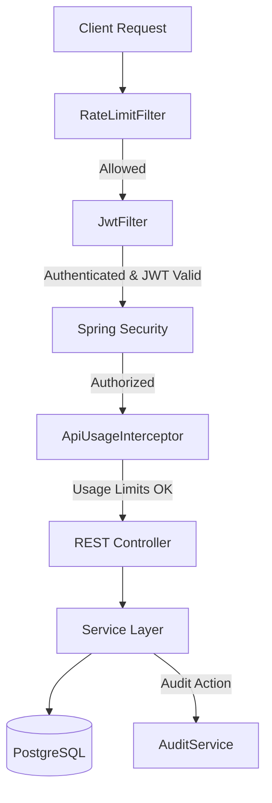

# TenantFlow

TenantFlow is a Spring Boot application designed as a robust backend foundation for a Multi-Tenant SaaS platform. It manages tenant registration, tenant-specific plans, user accounts with role-based access control, and enforces API limits and request rate-limiting dynamically.

It uses PostgreSQL for persistence and custom JWT-based authentication to enforce strict tenant isolation.

---

## Architecture Flow & Key Features

TenantFlow integrates multiple middleware layers to secure, throttle, and log requests:



### Key Features
1. **Tenant Isolation:** Enforces user association with a specific Tenant ID and verifies all requests using JWT claims.
2. **Native Environment Config:** Loads configurations dynamically from a `.env` file or environment variables, avoiding hardcoded secrets or ports.
3. **Plan-based Limits:** Checks user count limits and API call usage against the tenant's current plan (e.g. `FREE`, `BASIC`, `PREMIUM`, `ENTERPRISE`).
4. **API Call Interceptor (`ApiUsageInterceptor`):** Checks and tracks API usage per tenant and blocks requests with `UpgradeRequiredException` once limits are reached.
5. **Rate Limiting (`RateLimitFilter`):** Protects routes from denial-of-service and brute-force attempts.
6. **Detailed Auditing (`AuditLog`):** Logs crucial system changes, actions, and security events.

---

## Prerequisites

Before running the application, make sure you have:
* **Java 17** or higher
* **Maven 3.6+**
* **PostgreSQL** running locally or via Docker

---

## Setup & Configuration

### 1. Environment Configuration

Create a `.env` file in the root directory of the project. A template is provided in `.env.example`.

```properties
PORT=50000
DB_URL=jdbc:postgresql://localhost:5432/tenantflow
DB_USERNAME=myuser
DB_PASSWORD=mypassword
JWT_SECRET=mySuperSecretKeyForJwtGeneration
```

### 2. Spring Config Load

The application loads these environment variables natively using the configuration import system in `src/main/resources/application.yml`:

```yaml
spring:
  config:
    import: "optional:file:.env[.properties]"
```

---

## Running the Application

### Build the Project
Compile the code and package the executable JAR:
```bash
mvn clean install
```

### Run the Application
Start the Spring Boot server:
```bash
mvn spring-boot:run
```
The application will listen on the port configured in your `.env` (default is `50000`).

---

## Project Structure

The codebase is organized as follows:

```
tenantflow/
├── src/main/java/com/tenantflow/
│   ├── config/          # Web MVC and Spring Security configurations
│   ├── controller/      # Auth, Plan, and Tenant REST endpoints
│   ├── dto/             # API Request & Response Data Transfer Objects
│   ├── exception/       # Custom exceptions and GlobalExceptionHandler
│   ├── model/           # JPA Entities (Plan, Tenant, User, AuditLog, TenantUsage)
│   ├── repository/      # Spring Data JPA Repositories
│   ├── security/        # Security filters (JwtFilter, RateLimitFilter) and Interceptors
│   ├── service/         # Services (Tenant, User, Plan, Audit, Jwt)
│   └── TenantFlowApplication.java
├── src/main/resources/
│   └── application.yml  # YAML configurations (imports .env)
├── .env                 # Environment variables (git-ignored)
├── .env.example         # Template for environment configuration
└── pom.xml              # Maven dependencies
```

---

## API Endpoints & Usage

### 1. Authentication (`/api/auth`)

#### Register a User
Registers a new user and associates them with a tenant.
* **Endpoint:** `POST /api/auth/register`
* **cURL Command:**
```bash
curl -X POST http://localhost:50000/api/auth/register \
  -H "Content-Type: application/json" \
  -d '{
    "name": "Jane Doe",
    "email": "jane.doe@example.com",
    "password": "securepassword123",
    "role": "OWNER",
    "tenantId": "d3b07384-d113-49cd-a5d6-84e1b80c55f1"
  }'
```

#### Login
Authenticates a user and returns a JWT token.
* **Endpoint:** `POST /api/auth/login`
* **cURL Command:**
```bash
curl -X POST http://localhost:50000/api/auth/login \
  -H "Content-Type: application/json" \
  -d '{
    "email": "jane.doe@example.com",
    "password": "securepassword123"
  }'
```

---

### 2. Tenant Management (`/api/tenants`)

> **Note:** Requires JWT Authentication. Pass the received token as a Bearer token in the `Authorization` header.

#### Create a Tenant
Creates a new tenant under a specific plan.
* **Endpoint:** `POST /api/tenants`
* **cURL Command:**
```bash
curl -X POST http://localhost:50000/api/tenants \
  -H "Authorization: Bearer <your_jwt_token>" \
  -H "Content-Type: application/json" \
  -d '{
    "companyName": "Acme Corp",
    "subdomain": "acme",
    "status": "ACTIVE",
    "planId": "a1b2c3d4-e5f6-7a8b-9c0d-e1f2a3b4c5d6"
  }'
```

#### List All Tenants
Retrieves details of all tenants.
* **Endpoint:** `GET /api/tenants`
* **cURL Command:**
```bash
curl -X GET http://localhost:50000/api/tenants \
  -H "Authorization: Bearer <your_jwt_token>"
```

#### Get Tenant by ID
Retrieves details of a specific tenant by UUID.
* **Endpoint:** `GET /api/tenants/{id}`
* **cURL Command:**
```bash
curl -X GET http://localhost:50000/api/tenants/d3b07384-d113-49cd-a5d6-84e1b80c55f1 \
  -H "Authorization: Bearer <your_jwt_token>"
```

#### Update Tenant
Updates tenant information.
* **Endpoint:** `PUT /api/tenants/{id}`
* **cURL Command:**
```bash
curl -X PUT http://localhost:50000/api/tenants/d3b07384-d113-49cd-a5d6-84e1b80c55f1 \
  -H "Authorization: Bearer <your_jwt_token>" \
  -H "Content-Type: application/json" \
  -d '{
    "companyName": "Acme Global",
    "subdomain": "acmeglobal",
    "status": "ACTIVE",
    "planId": "a1b2c3d4-e5f6-7a8b-9c0d-e1f2a3b4c5d6"
  }'
```

#### Delete Tenant
Deletes a tenant by UUID.
* **Endpoint:** `DELETE /api/tenants/{id}`
* **cURL Command:**
```bash
curl -X DELETE http://localhost:50000/api/tenants/d3b07384-d113-49cd-a5d6-84e1b80c55f1 \
  -H "Authorization: Bearer <your_jwt_token>"
```

---

### 3. Subscription Plans (`/api/plans`)

> **Note:** Write operations (`POST`, `PUT`, `DELETE`) require JWT Authentication and are restricted to users with `ADMIN` or `OWNER` roles.

#### Create a Plan
Creates a new billing/subscription plan.
* **Endpoint:** `POST /api/plans`
* **cURL Command:**
```bash
curl -X POST http://localhost:50000/api/plans \
  -H "Authorization: Bearer <your_jwt_token>" \
  -H "Content-Type: application/json" \
  -d '{
    "name": "PREMIUM",
    "monthlyPrice": 99.99,
    "apiCallLimit": 50000,
    "maxUsers": 100
  }'
```

#### List All Plans
Retrieves all available billing plans.
* **Endpoint:** `GET /api/plans`
* **cURL Command:**
```bash
curl -X GET http://localhost:50000/api/plans \
  -H "Authorization: Bearer <your_jwt_token>"
```

#### Get Plan by ID
Retrieves details of a specific plan by UUID.
* **Endpoint:** `GET /api/plans/{id}`
* **cURL Command:**
```bash
curl -X GET http://localhost:50000/api/plans/a1b2c3d4-e5f6-7a8b-9c0d-e1f2a3b4c5d6 \
  -H "Authorization: Bearer <your_jwt_token>"
```

#### Update Plan
Updates plan properties by UUID.
* **Endpoint:** `PUT /api/plans/{id}`
* **cURL Command:**
```bash
curl -X PUT http://localhost:50000/api/plans/a1b2c3d4-e5f6-7a8b-9c0d-e1f2a3b4c5d6 \
  -H "Authorization: Bearer <your_jwt_token>" \
  -H "Content-Type: application/json" \
  -d '{
    "name": "ENTERPRISE",
    "monthlyPrice": 499.99,
    "apiCallLimit": 1000000,
    "maxUsers": 1000
  }'
```

#### Delete Plan
Deletes a plan by UUID.
* **Endpoint:** `DELETE /api/plans/{id}`
* **cURL Command:**
```bash
curl -X DELETE http://localhost:50000/api/plans/a1b2c3d4-e5f6-7a8b-9c0d-e1f2a3b4c5d6 \
  -H "Authorization: Bearer <your_jwt_token>"
```

---

## Security Details

* **Filters:**
  - `RateLimitFilter` parses requests and applies rate limits.
  - `JwtFilter` extracts the Bearer token, validates it, and sets the Spring Security authentication context.
* **Authorization:**
  - Method-level security (`@PreAuthorize`) restricts write access on plans to users with the `ADMIN` or `OWNER` roles.
